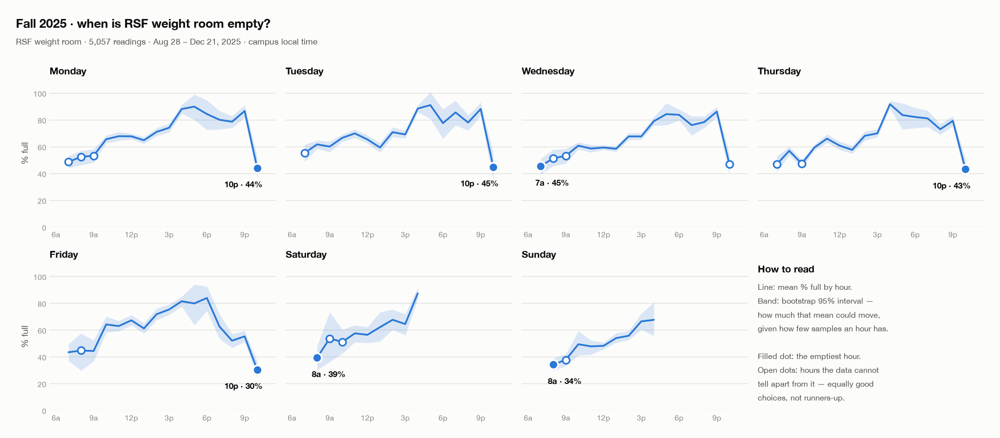
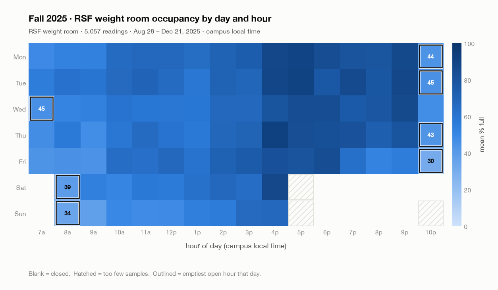
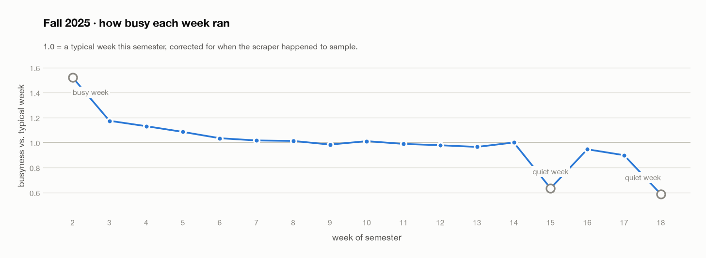
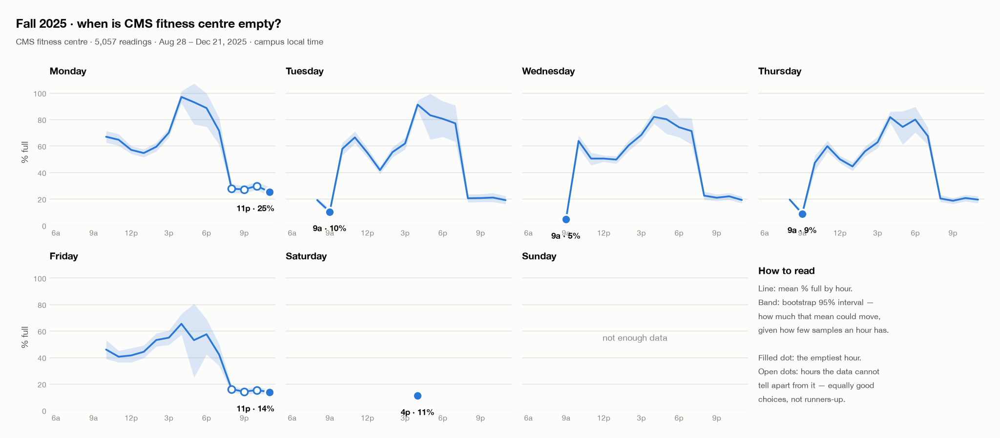
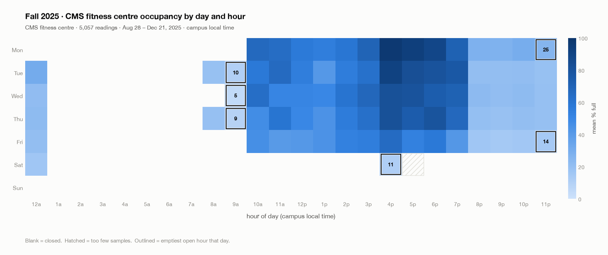
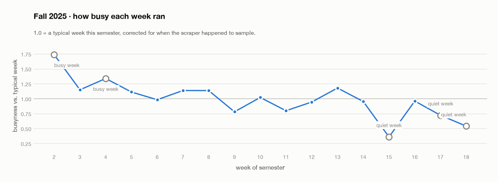

# Fall 2025 — Berkeley gym crowd report

Semester window **Aug 18, 2025 – Dec 21, 2025** · 10,114 readings · generated 2026-08-25.

All times are campus local (America/Los_Angeles); the scraper logs UTC and this report converts. An hour labelled *7AM–8AM* covers 7:00–7:59.

## RSF weight room

| Day | Go at | Mean % full | 95% CI | Just as good | Samples | Confidence |
| --- | --- | ---: | ---: | --- | ---: | --- |
| Monday | **10PM–11PM** | 44% | 36–52% | 7AM–8AM, 8AM–9AM, 9AM–10AM | 53 | moderate |
| Tuesday | **10PM–11PM** ¹ | 45% | 35–55% | 7AM–8AM | 40 | strong |
| Wednesday | **7AM–8AM** | 45% | 39–51% | 8AM–9AM, 9AM–10AM, 10PM–11PM | 53 | moderate |
| Thursday | **10PM–11PM** ¹ | 43% | 36–50% | 7AM–8AM, 9AM–10AM | 53 | moderate |
| Friday | **10PM–11PM** ¹ | 30% | 25–37% | 8AM–9AM | 53 | strong |
| Saturday | **8AM–9AM** | 39% | 30–48% | 9AM–10AM, 10AM–11AM | 6 | weak |
| Sunday | **8AM–9AM** | 34% | 30–39% | 9AM–10AM | 7 | weak |

¹ closing hour — the room shuts partway through, so it is genuinely quiet but briefly so.

<picture>
  <source media="(prefers-color-scheme: dark)" srcset="weekday-profiles-rsf-dark.png">
  
</picture>


<picture>
  <source media="(prefers-color-scheme: dark)" srcset="heatmap-rsf-dark.png">
  
</picture>


<details><summary>Table view — mean % full per hour</summary>

| Day | 7a | 8a | 9a | 10a | 11a | 12p | 1p | 2p | 3p | 4p | 5p | 6p | 7p | 8p | 9p | 10p |
| --- | ---: | ---: | ---: | ---: | ---: | ---: | ---: | ---: | ---: | ---: | ---: | ---: | ---: | ---: | ---: | ---: |
| Mon | 49 | 52 | 53 | 66 | 68 | 68 | 65 | 71 | 74 | 88 | 90 | 84 | 80 | 79 | 87 | 44 |
| Tue | 55 | 62 | 60 | 67 | 70 | 65 | 59 | 71 | 69 | 88 | 91 | 78 | 86 | 78 | 88 | 45 |
| Wed | 45 | 51 | 53 | 61 | 59 | 59 | 58 | 68 | 68 | 79 | 84 | 84 | 76 | 78 | 86 | 47 |
| Thu | 47 | 57 | 47 | 59 | 66 | 61 | 58 | 68 | 70 | 92 | 84 | 82 | 81 | 73 | 79 | 43 |
| Fri | 43 | 45 | 44 | 64 | 63 | 67 | 61 | 72 | 75 | 81 | 80 | 84 | 63 | 52 | 55 | 30 |
| Sat | · | 39 | 54 | 51 | 58 | 56 | 62 | 68 | 64 | 87 | · | · | · | · | · | · |
| Sun | · | 34 | 38 | 49 | 48 | 48 | 54 | 56 | 66 | 68 | · | · | · | · | · | · |

Mean % full per hour. `·` = closed, or too few samples to estimate.

</details>

### Does the pattern hold all semester?

The shape of the day is stable across the semester (best candidate split p = 0.973), so the table above applies throughout.

<picture>
  <source media="(prefers-color-scheme: dark)" srcset="weekly-trend-rsf-dark.png">
  
</picture>


Weeks running well *above* the semester norm: **2** — the busiest of them at **1.52×** a typical week. The start-of-semester rush is the usual cause, and it fades rather than holding: the trend above is the honest picture of how much a September answer is worth in November.

Weeks running well *below* it (breaks, holidays, post-finals): **15, 18**. They pull the averages down a little but barely move *which* hour is emptiest, so they are kept in.

## CMS fitness centre

| Day | Go at | Mean % full | 95% CI | Just as good | Samples | Confidence |
| --- | --- | ---: | ---: | --- | ---: | --- |
| Monday | **11PM–12AM** | 25% | 22–29% | 8PM–9PM, 9PM–10PM, 10PM–11PM | 53 | moderate |
| Tuesday | **9AM–10AM** | 10% | 8–13% | — | 52 | strong |
| Wednesday | **9AM–10AM** | 5% | 4–5% | — | 27 | strong |
| Thursday | **9AM–10AM** | 9% | 7–11% | — | 45 | strong |
| Friday | **11PM–12AM** | 14% | 12–16% | 8PM–9PM, 9PM–10PM, 10PM–11PM | 61 | moderate |
| Saturday | **4PM–5PM** ¹ | 11% | 6–16% | 12AM–1AM | 10 | moderate |
| Sunday | — | — | — | — | 0 | not enough data |

¹ closing hour — the room shuts partway through, so it is genuinely quiet but briefly so.

<picture>
  <source media="(prefers-color-scheme: dark)" srcset="weekday-profiles-cms-dark.png">
  
</picture>


<picture>
  <source media="(prefers-color-scheme: dark)" srcset="heatmap-cms-dark.png">
  
</picture>


<details><summary>Table view — mean % full per hour</summary>

| Day | 12a | 8a | 9a | 10a | 11a | 12p | 1p | 2p | 3p | 4p | 5p | 6p | 7p | 8p | 9p | 10p | 11p |
| --- | ---: | ---: | ---: | ---: | ---: | ---: | ---: | ---: | ---: | ---: | ---: | ---: | ---: | ---: | ---: | ---: | ---: |
| Mon | · | · | · | 67 | 65 | 57 | 55 | 59 | 70 | 97 | 93 | 89 | 71 | 28 | 27 | 30 | 25 |
| Tue | 31 | 19 | 10 | 58 | 66 | 55 | 42 | 55 | 62 | 91 | 83 | 80 | 77 | 20 | 21 | 21 | 19 |
| Wed | 21 | · | 5 | 64 | 50 | 50 | 50 | 60 | 68 | 82 | 80 | 74 | 71 | 22 | 21 | 22 | 19 |
| Thu | 22 | 19 | 9 | 47 | 60 | 50 | 45 | 56 | 63 | 82 | 74 | 80 | 67 | 20 | 19 | 21 | 19 |
| Fri | 21 | · | · | 46 | 41 | 41 | 44 | 53 | 55 | 65 | 53 | 57 | 42 | 16 | 14 | 15 | 14 |
| Sat | 16 | · | · | · | · | · | · | · | · | 11 | · | · | · | · | · | · | · |
| Sun | · | · | · | · | · | · | · | · | · | · | · | · | · | · | · | · | · |

Mean % full per hour. `·` = closed, or too few samples to estimate.

</details>

### Does the pattern hold all semester?

The shape of the day is stable across the semester (best candidate split p = 0.867), so the table above applies throughout.

<picture>
  <source media="(prefers-color-scheme: dark)" srcset="weekly-trend-cms-dark.png">
  
</picture>


Weeks running well *above* the semester norm: **2, 4** — the busiest of them at **1.74×** a typical week. The start-of-semester rush is the usual cause, and it fades rather than holding: the trend above is the honest picture of how much a September answer is worth in November.

Weeks running well *below* it (breaks, holidays, post-finals): **15, 17, 18**. They pull the averages down a little but barely move *which* hour is emptiest, so they are kept in.

## Method & caveats

- **Closed hours are excluded.** An hour whose median reading is ≤5% is the gym being shut, not the gym being quiet; without this, 3AM wins every day.
- **Opening and closing hours** are kept but have their zero readings dropped first, and are marked ¹ — genuinely quiet, but only for part of the hour.
- **Intervals are bootstrap 95% intervals** on each hour's mean (4,000 resamples, fixed seed). The *Just as good* column lists every hour whose difference from the winner has an interval straddling zero — with this few samples these are ties, not runners-up.
- **The phase test** is a block permutation test: whole days are shuffled along the timeline and the best split found in the real data is compared against the best split found in 1,000 shuffled timelines. The semester is only cut where that test clears p < 0.05.
- **The phase test has limited power on thin data.** A stable verdict means no *large* shape change was detectable, not that nothing shifted; a semester with a few hundred readings can only reveal shifts on the scale of the morning/evening balance flipping.
- **Sampling is uneven.** The scraper runs on GitHub Actions cron, which is throttled and delayed, so some hours are sampled far more than others. Sample counts are shown; treat any *weak* confidence row as a hint rather than an answer.

### Data quality this run

- Rows read: **6,886** · kept: **6,884** · unparseable: **2** · out-of-range values dropped: **0**

<details><summary>Examples of dropped rows</summary>

```
2026-08-17 23:41:48,%=
,%=

2026-08-19 22:01:03,=
%,=
%
```

</details>

